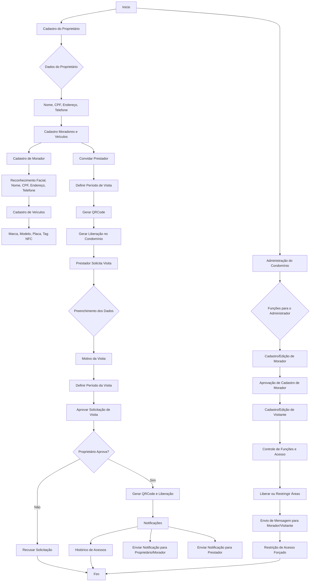

# Sistema de Controle de Acesso e Gerenciamento de Visitas para Condomínios

O projeto visa desenvolver um **Sistema de Controle de Acesso e Gerenciamento de Visitas** para condomínios, focando na segurança, organização e facilidade de gestão de entradas e saídas. O sistema integra autenticação segura, utilizando reconhecimento facial e QRCode, e oferece funcionalidades personalizáveis para diferentes usuários: proprietários, moradores, prestadores de serviço e administradores.

## Sumário

1. [Objetivos](#objetivos)
2. [Requisitos Iniciais](#requisitos-iniciais)
   - [Funcionalidades Essenciais](#funcionalidades-essenciais)
   - [Funcionalidades Adicionais Sugeridas](#funcionalidades-adicionais-sugeridas)
3. [Fluxo de Cadastro e Acesso](#fluxo-de-cadastro-e-acesso)
4. [Tecnologias Utilizadas](#tecnologias-utilizadas)
5. [Contribuindo](#contribuindo)

---

## Objetivos

- **Facilitar o cadastro e monitoramento de acessos.**
- **Simplificar a autorização de visitas** por meio de QRCode e reconhecimento facial.
- **Prover uma visão detalhada do fluxo de pessoas** no condomínio.
- **Gerar relatórios de uso**, notificações em tempo real e controle restrito de áreas para administradores.

---

## Requisitos Iniciais

### Funcionalidades Essenciais

1. **Cadastro de Proprietários e Moradores**
   - Dados pessoais: nome, CPF, endereço, telefone.
   - Cadastro de moradores com reconhecimento facial.
   - Cadastro de veículos (marca, modelo, placa, tag NFC).

2. **Gestão de Acesso e Convites de Visita**
   - Proprietário pode convidar prestadores e definir período de visita.
   - Geração de QRCode para acesso temporário.
   - Aprovação ou recusa de visitas pelo proprietário.

3. **Gestão de Prestadores de Serviço**
   - Cadastro de prestadores: dados pessoais, reconhecimento facial, empresa.
   - Aceitação de convite para visita.
   - Definição do motivo e período da visita.

4. **Funções para Administração do Condomínio**
   - Cadastro e edição de moradores e visitantes.
   - Aprovação de cadastros de moradores.
   - Controle de acesso a áreas e envio de notificações.
   - Restrição de acesso forçado, mesmo se autorizado por moradores.

5. **Funcionalidades de Segurança e Auditoria**
   - Histórico de acessos de moradores, visitantes e prestadores.
   - Notificações em tempo real sobre atividades suspeitas.
   - Integração com sistema de segurança (câmeras, alarmes).

### Funcionalidades Adicionais Sugeridas

- **Painel de Relatórios:** Análise de dados sobre frequência de visitas e áreas mais acessadas.
- **Check-in/Check-out digital** para prestadores de serviço.
- **Controle de Permissões Avançado:** Autorização de áreas específicas para moradores e visitantes.

---

## Fluxo de Cadastro e Acesso

